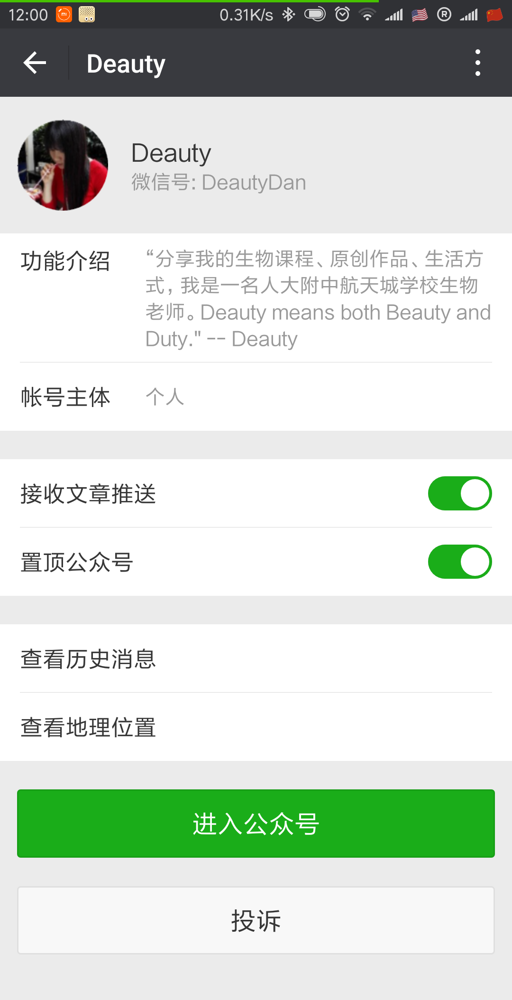

# 初中生物课件分享

- 课件PPT打开不需要密码。

- 为了防止意外编辑，设置了**编辑密码**，是`rdfzhtclidan`（即**人大附中航天城**拼音首字母 + 作者名字**lidan**）

- 建议在原课件的基础上，另存为新文件后，再进行编辑。

- ，欢迎提问和建议。

- 或者关注下面的公众号留言。

# 欢迎扫描关注公众号

 
  

 

- 这里的课件对应微信公众号的推送内容。

- 或者搜索微信公众号``DeautyDan``关注。

    

-----------------------------

# MilldeSchooleGradeOne
Millde Schoole Grade One Biology Class Presentations from teacher Li, Dan.
